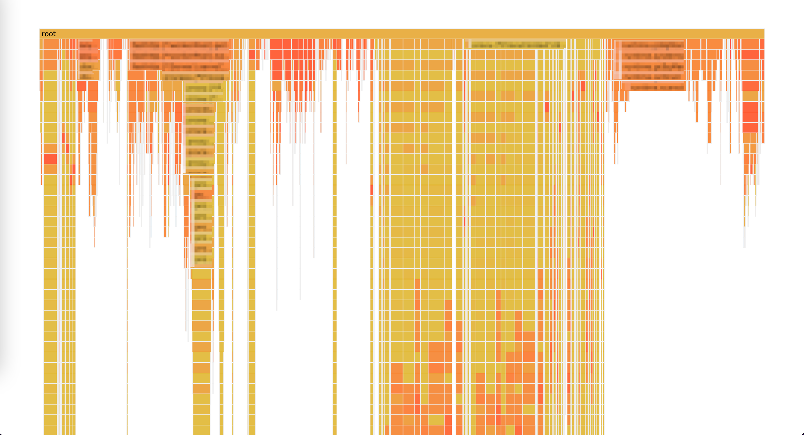
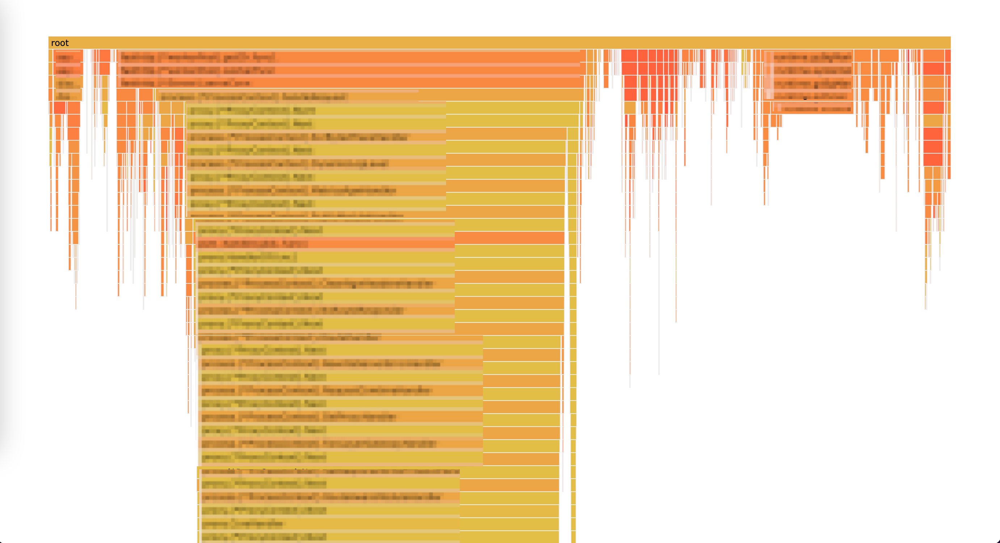

# README

When [pprof](https://github.com/google/pprof) takes samples from a running program, 
it will trim some stack elements from the root end if the stack is too deep.
When one or more stack elements are trimmed from each stack, 
the stacks will not be able to align with each other, 
then the FlameGraph will be hard to read (the following 'before.pprof' graph). 

This tool will try to fix the pprof file by guessing the trimmed root elements (the following 'after.pprof' graph).

```bash
guess-pprof -i before.pprof -o after.pprof
```

before.pprof:



after.pprof:



## How to guess?

Suppose we have 2 stacks in a graph: A & B. When the root end elements of a stack A overlaps elements in stack B,
then we guess stack A should have trimmed some root elements the same as those in stack B under the overlapping elements
(shown in the following 'guess' graph).


The longer the overlapping part is, the more trustable the guess is. 

If you are interested in the algorithm to realize it, please refer to [algorithm](fix/README.md).

# Installation

```bash
go get github.com/xnslong/guess-stack/guess-pprof
```

# Usage

```
Usage of ./guess-pprof:
  -i string
        input file (default "-")
  -o string
        output file (default "-")
  -overlap int
        trustable overlap length. when the number of overlapping elements is less than the length, it's not considered trustable for guessing (default 5)
  -v    show verbose info for debug
```

```bash
./guess-pprof -i before.pprof -o after.pprof
```
