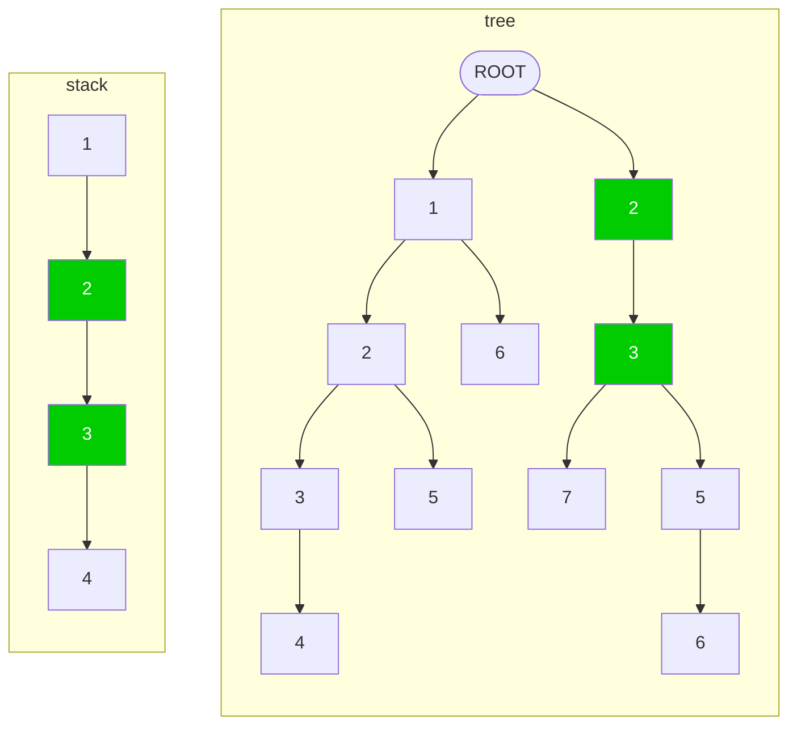

# README

当前文档主要描述猜测栈节点的算法。

# 问题

我们把一个调用栈从根到叶子表示成一个列表。 那么调用顺序就是左侧调用右侧。因此左侧会相对更稳定，而右侧更多变。

```
Sn = [f1, f2, f3, ..., fn]
    (root)            (leaf)
```

假设每个列表左侧会有不定个数的连续节点被截断，那么列表之间就没有办法互相对齐了。 我们需要补齐这里面被截掉的节点，好让各个列表能重新互相对齐。

例如：原始栈

```
S1 = [f1, f2, f3, f4, f5, f6, f8, f9]
S2 = [f1, f2, f3, f4, f7]
```

假设`S1`左侧截断了`f1, f2`，则会变成下面这样，就没有办法对齐了

```
S1 = [f3, f4, f5, f6, f8, f9]      (截掉了 f1, f2)
S2 = [f1, f2, f3, f4, f7]
```

恢复出来后需要能重新变成

```
S1 = [f1, f2, f3, f4, f5, f6, f8, f9]  (恢复被截掉的 f1, f2)
S2 = [f1, f2, f3, f4, f7]
```

## 记号约定

为了下面分析方便，我们对列表做如下一些约定：

假设两个列表

```
A = [e1, e2, e3]
B = [e4, e5]
```

用`A+B`记先`A`后`B`的方式将元素连接起来形成一个新的列表，示例如下：

```
A+B = [e1, e2, e3, e4, e5]
B+A = [e4, e5, e1, e2, e3]
```

用`|A|`记列表`A`的长度，示例如下：

```
|A| = 3
|B| = 2
|A+B| = 5
|B+A| = 5
```

假设 `A = C + D`，则称`C`是`A`的一个前缀。假设列表`C`是`A`和`B`的最长公共前缀，我们记：

```
C = A & B
```

我们知道一定存在列表`D`和`E`，使得

```
A = C + D
B = C + E

| D & E | = 0
```

# 分析

如果两个栈根部原本相同， 即

```
S1 = A0 + A1 + A2
S2 = A0 + A1 + A3
```

其中`| A2 & A3 | = 0`，`| A0 | > 0`, `| A1 | > 0`.

假设`S1`被截掉子列表`A0`，则截掉之后：

```
S1 = A1 + A2
S2 = A0 + A1 + A3
```

那么`S1`根部节点被截掉后，他里面剩余的根部节点`A1`应该能与`S2`的中间部分节点重叠。因此，我们可以通过重叠的位置，推测出`S1`被截掉的是`A0`，从而补全它。

这里重叠部分`A1`越长，那么这种猜测成立的可能性就越大。

# 解决思路

如果栈`S1`的根部与`S2`最长重叠时可以按照如下分割：

```
S1 = A1 + A2
S2 = A0 + A1 + A3
```

其中 `|A0| > 0` 且 `| A2 & A3 | = 0`，则记最长重叠（`MOR`, `max overlapping range`）如下：

```
起始：MORS(S1, S2) = |A1 + A3| // 重叠部分起始位置，从叶子结点开始计算
长度：MORL(S1, S2) = |A1|      // 重叠部分的长度
```

如果`MORL(S1, S2) = 0`，那么说明这两个栈节点没有重叠的部分，他们可能没有相同的根。

当存在多个栈时（如：`{S1, S2, S3, ..., Sn}`），对于`Si`，我们能够找出它与任意一个栈`Sj`的最长重叠（`MORL(Si, Sj)`）。 我们再记假设`Sk`
存在 `MORL(Si,Sk) = max{MORL(Si, Sj)}, j != i`，我们称`MORL(Si,Sk)`为最佳匹配，简记为`MORL(Si) = MORL(Si,Sk)` 。

| MORL | 1         | 2         | 3         | ... | n         | max MORL                 |
|------|-----------|-----------|-----------|-----|-----------|--------------------------|
| 1    | -         | MORL(1,2) | MORL(1,3) | ... | MORL(1,n) | MORL(1) = max{MORL(1,k)} |
| 2    | MORL(2,1) | -         | MORL(2,3) | ... | MORL(2,n) | MORL(2) = max{MORL(2,k)} |
| 3    | MORL(3,1) | MORL(3,2) | -         | ... | MORL(3,n) | MORL(3) = max{MORL(3,k)} |
| ...  | ...       | ...       | ...       | ... | ...       | ...                      |
| n    | MORL(n,1) | MORL(n,2) | MORL(n,3) | ... | -         | MORL(n) = max{MORL(n,k)} |

我们可以从`MORL(Si)`由长到短的顺序修复栈的根结点部分。

## 不需动态计算`MOR`

假设栈`Si`的最佳猜测是补充`Sj`的部分根部节点，那么当`Si`补充相关节点后，其他的栈是否需要更新对`Si`的`MOR`？

结论是：不需要

**证明如下：**

假设 `Si` 为当前修复的栈，且最优解是参考`Sj`做修复，则可以将`Si`与`Sj`表示如下：

```
Si = A1 + A2
Sj = A0 + A1 + A3
```

其中`| A2 & A3 | = 0`。此时 `MORL(i,j) = |A1|`

修复 `Si` 后，我们可以知道`Si`会获得`Sj`的`A0`这部分节点作为新的根节点。即：

```
Si = A0 + A1 + A2
```

假设尚未修复的栈`Sk`的`MORL(k)`会因为`Si`的修复而有所变化，那么新的更优的`MORL(k)`一定是起始于`A0`的某个节点的。 那么起始与`A0`的重叠部分可能造就比此前的`MORL(k)`更大的值吗？

由于我们是按`MORL(i)`长度从大往小修复的，因此可以知道

```
MORL(k,j) <= MORL(k) < MORL(i) = | A1 |
```

可以知道`Sk`与`Sj`在起始`A0`这个范围内的重叠部分`A`，一定是`A0 + A1`这个列表的子列表（右侧不会触达`A1`的右边界）， 否则`|A| = |A1| + |A0'| > |A1|`
，与前面的`MORL(k,j)<|A1|`相矛盾。

因此可以肯定在新的`Si = A0 + A1 + A2`这个列表中，起始与`A0`的重叠部分与`Sj`的相同，不会新产生出比当前`MORL(k,j) <= MORL(k)`更长的重叠列表。

## 不能循环

这里可以将上述的共享根节点过程理解为构建一颗树。共享根节点的过程即为将一个栈添加到另一个栈的某个节点的子节点列表中。

那么需要保证最终是一棵树，而不应该出现环


这样的限制总结起来就是：

1. 不应该嫁接在当前栈自己身上。
2. 嫁接的目标栈，不应该存在一条传递的嫁接链，最后重新嫁接回了当前栈。

## 引入前缀树，将计算复杂度从O(n^2)降至O(n)

根据前面的分析，我们需要将一个栈与剩下的其他每个栈进行匹配和对比，才能找出`MORL`最大的匹配。假设计算一个栈在另一个栈上的最大匹配为一个基本操作， 则对于`n`个栈的情况，我们需要`n * (n-1)`
此基本操作，才能找出每个栈的最佳匹配，复杂度是`O(n^2)`。但是这个结果实际上是由优化空间的，看下面的例子，假设：

```
Si = A1 + A2
Sj = A1 + A3
```

其中 `| A2 & A3 | = 0`

如果我们比较了`Si`与另一个栈`Sk`的重叠`MORL(i,k) < |A1|`，那么可以知道`A1`是没有办法完整匹配`Sk`中的任何部分的，因此我们可以知道`MORL(j,k) = MORL(i,k)`，此时`Sj`与`Sk`
的对比重叠部分是完全多余的操作。那么怎样消除这些多余操作呢？前缀树就是一个方法。

首先我们将所有的栈合并到一棵前缀树中，使得输从根到每个叶子结点组成的一条路径都是原始问题的一个栈。此时我们就可以将一个栈和整个前缀树进行比较了。 此时只需要一次计算`MORL`的基本操作，我们就能计算出前缀树中所有栈到这个栈的最佳重叠情况。

如下图所示，假设我们有5个栈，并且把他们加入了同一棵前缀树：

栈如下：

```
S1 = [ 1, 2, 3, 4 ]
S2 = [ 1, 2, 5 ]
S3 = [ 1, 6 ]
S4 = [ 2, 3, 5, 6 ]
S4 = [ 2, 3, 7 ]
```



我们将`S1`与整棵树进行匹配，我们发现在公共根`[1]`的情况下，剩余的子栈`[ 2, 3, 4 ]`可以和树的右分枝部分路径`[ 2, 3 ]`重叠，因此我们知道：

* `S1` / `S2` / `S3` 都不会与 `S1` 重叠。即，当 `i = 1, 2, 3`时，`MORL(i,1) = 0`。
* `S4` / `S5` 都与`S1`有长度为`2`的重叠。即，当 `i = 4, 5`时，`MORL(i,1) = 2`。

因此，我们只需要将栈(`j`)与前缀树进行一次基础的比较，我们就能知道所有栈`i`到`j`的重叠情况`MORL(i,j)`。因此最终我们只需要`O(n)`次基础比较， 就能得出所有栈的最佳匹配情况。