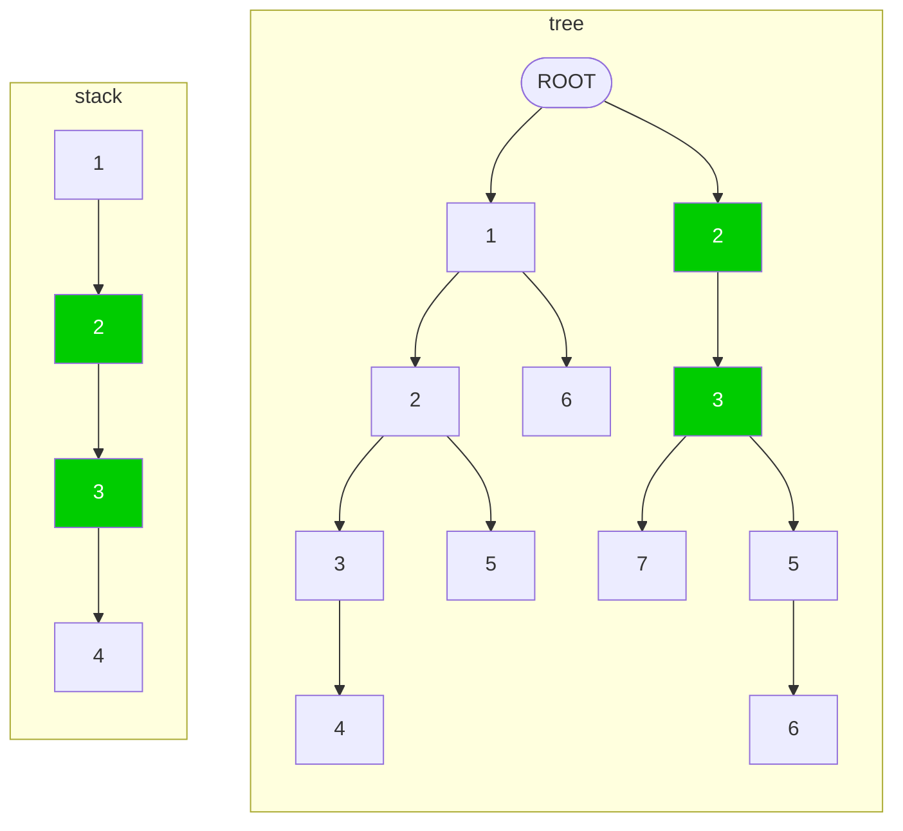

# README

[中文README](README-zh.md)

The current doc mainly describes the algorithm for guessing stack nodes.

# Question

We represent a call stack from root to leaf as a list. Then the call order is the left calling the right. Therefore, the
left side will be relatively more stable and the right side will be more transient.

```
Sn = [f1, f2, f3, ..., fn]
    (root)            (leaf)
```

Assuming some consecutive nodes trimmed on the left side of each list, then the lists cannot align with each other any
more. We need to fill in the trimmed nodes so that the lists can align with each other again.

For example: original stack

```
S1 = [f1, f2, f3, f4, f5, f6, f8, f9]
S2 = [f1, f2, f3, f4, f7]
```

Assuming that nodes `f1, f2` is trimmed from stack `S1` on the left trimmed, it will become the following case, and can
not align with each other anymore.

```
S1 = [ f3, f4, f5, f6, f8, f9 ] // (with f1, f2 trimmed) 
S2 = [ f1, f2, f3, f4, f7 ]
```

After recovering, it should be the following

```
S1 = [ f1, f2, f3, f4, f5, f6, f8, f9 ]
S2 = [ f1, f2, f3, f4, f7 ]
```

## Mark Agreement

For the convenience of the following analysis, we make the following conventions for lists：

Given two lists

```
A = [e1, e2, e3]
B = [e4, e5]
```

We mark `A + B` as a list concatenating `A` and `B` with all elements from `A` before `B`, shown as following:

```
A+B = [e1, e2, e3, e4, e5]
B+A = [e4, e5, e1, e2, e3]
```

mark `| A |` as the length of list `A` , for example:

```
|A| = 3
|B| = 2
|A+B| = 5
|B+A| = 5
```

If `A = C + D`, then we call `C` a prefix of `A`. Suppose `C` is the longest list as common prefix for list `A` & `B`,
we mark

```
C = A & B
```

we know there should be a list `D` and `E`, making

```
A = C + D
B = C + E

| D & E | = 0
```

# Analysis

If the roots of the two stacks is like following

```
S1 = A0 + A1 + A2
S2 = A0 + A1 + A3
```

Where `| A2 & A3 | = 0` and `|A0| > 0, |A1| > 0`.

Assuming `A0` is trimmed from `S1`, then after trimmed, the 2 stacks becomes:

```
S1 = A1 + A2
S2 = A0 + A1 + A3
```

Here we know the remaining root `A1` in `S1` should overlap with a middle list of `S2`. Therefore, we can guess
that `A0` is trimmed from `S1` through the overlapping position in `S2`.

The longer the overlapping `A1` is, the more trustable this guess is.

# Solution

If we can devide `S1` and `S2` in the following way, with `A1` has the longest length.

```
S1 = A1 + A2
S2 = A0 + A1 + A3
```

Where `| A0 | > 0` and `| A2 & A3 | = 0`,

Then the max overlapping range (`MOR`) is recorded as follows:

```
start : MORS(S1, S2) = |A1 + A3| // start of max overlapping range in S2, from leaf.
length: MORL(S1, S2) = | A1 |    // length of max overlapping range
```

If `MORL (S1, S2) = 0` , then the two stack nodes do not overlap, and they may not have the same root.

When there are multiple stacks (such as: `{S1, S2, S3,..., Sn}`), for `Si`, we can find `MORL` with any other
stack `Sj` (`MORL(i, j)` ).

Among them, the biggest `MORL(i, j)` is the most trustable guess: `Si` should have the same root as `Sj` from
node `MORS(Si, Sj)`. We mark `MORL(i) = max{ MORL(i, Sj) }`, where `j != i`. We call stack `j` is the best match for
stack `i`.

| MORL | 1           | 2           | 3           | ... | n         | max MORL                     |
|------|-------------|-------------|-------------|-----|-----------|------------------------------|
| 1    | -           | MORL(1,2)   | MORL(1,3)   | ... | MORL(1,n) | MORL(1) = max{MORL(1,k)}     |
| 2    | MORL(2,1)   | -           | MORL(2,3)   | ... | MORL(2,n) | MORL(2) = max{MORL(2,k)}     |
| 3    | MORL(3,1)   | MORL(3,2)   | -           | ... | MORL(3,n) | MORL(3) = max{MORL(3,k)}     |
| ...  | ...         | ...         | ...         | ... | ...       | ...                          |
| n    | MORL (n, 1) | MORL (n, 2) | MORL (n, 3) | ... | -         | MORL (n) = max {MORL (n, k)} |

Then we can fix the stacks `Si` in the order of `MORL(i)` from big to small.

## Not To Dynamic Calculation 'MOR'

Assuming that the best guess of stack `Si` is to share root nodes from `Sj`, and fix the stack `Si`, does any other
unfixed stack need to update the `MOR` due to this operation?

The conclusion is: not needed

**Proof as following:**

Assuming

```
Si = A1 + A2
Sj = A0 + A1 + A3
```

Where `| A2 & A3 | = 0`. At this time `MORL(i, j) = | A1 |`. After fixing `Si` , we can know:

```
Si = A0 + A1 + A2
```

Assuming that an unfixed stack `Sk` previously having best match with `MORL(k)` need to be updated due to the fix
of `Si` , then the new better `MORL(k)` must be of a range starting at a node in `A0`. Can the new overlapping range be
bigger than the previous `MORL(k)`?

Since we are fixing all stacks in the order of `MORL` from big to small, we can know for the present stack `Sk`
matching `Sj` having the following relations.

```
MORL(k,j) <= MORL(k) < MORL(i) = | A1 |
```

So, any overlapping range `A` for `Sk` on `Sj` starts from node in `A0`, should be a sublist of `A0 + A1`. (
otherwise `| A |` should have a bigger length than `| A1 |`, counter with the previous conclusion `MORL(k,j) < |A1|`)

Now `Si` has the same range `A0 + A1` with `Sj`. So any overlapping range starting at a node in `A0` will be the same
with that in `Sj` (not better than the current `MORL(k,j)`, not to say the `MORL(k)`)

Therefore, it is certain that in the new `Si = A0 + A1 + A2` list, it will not produce a new longer overlapping list for
any unfixed stack `Sk`.

## Avoid Loop

The above procedure of sharing root nodes can be understood here as constructing a tree.

The process of sharing root nodes is to add one stack to the children list of a node of another stack. Then we need to
make sure that it ends up with a tree, with no loop in it.


This limitation can be summed up as following:

1. Self-overlap should not be allowed.
2. A stack cannot share the root from other stack where it has transitively shared root from the current stack.

## Introduce prefix tree to reduce complexity from $O\(n^2)$ to O(n)

In the analysis above, we have to compare a stack to all other stacks to find out the best match. Suppose we have `n`
stacks in total, and comparing one stack to another to calculate the `MORL` for the 2 stacks to be a basic operation.
then `n * (n-1)` runs of comparisons are required. The complexity is `O(n^2)`. However, there is possibility for
improvement. Suppose we have 2 stacks

```
Si = A1 + A2
Sj = A1 + A3
```

where `| A2 & A3 | = 0`.

If we have compared `Si` to `Sk`, and get `MORL(i,k) < |A1|`. That's to say `A1` can fully overlap any part of `Sk`.
Then we can just tell `MORL(j,k) = MORL(i,k)`, and comparing `Sj` to `Sk` is a redundant operation. So how to reduce the
redundant comparisons? The prefix tree is just a way to reach it.

First we combine all stacks to a prefix tree, ensuring any path from root to a leaf to be a stack of the input problem.
Then we can compare a stack to the whole tree, we will get the `MORL` from all stacks in the tree to the current stack
with just 1 run of comparisons.

Shown as the following diagram. Suppose we have 5 stacks and join them into the same prefix tree.

The stacks are:

```
S1 = [ 1, 2, 3, 4 ]
S2 = [ 1, 2, 5 ]
S3 = [ 1, 6 ]
S4 = [ 2, 3, 5, 6 ]
S4 = [ 2, 3, 7 ]
```



When we match `S1` with the tree, we spare `[1]` as the root, and compare the remainder substack `[ 2, 3, 4 ]` with the
tree, we can easily find the overlapping part `[ 2, 3 ]` on the right path of the tree. Then we will know:

* `S1` / `S2` / `S3` cannot overlap `S1`, i.e. `MORL(i,1)=0`, where `i in {1, 2, 3}`.
* `S4` / `S5` can overlap it with `MORL` to be `2`. i.e. `MORL(i,1)=2`, where `i` in `{4, 5}`.

Therefore, when performing a run of comparisons for stack (`j`) to the prefix tree, we can know `MORL(i,j)` for all `i`
in `{1..n}`, with `O(1)` basic operation. So finally we just need `O(n)` basic runs of comparisons.


