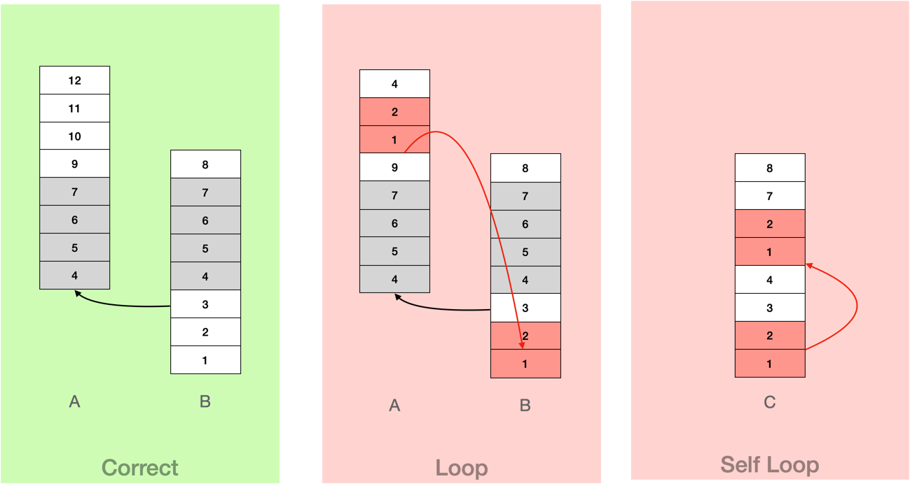

# README

[中文README](README-zh.md)

The current doc mainly describes the algorithm for guessing stack nodes.

# Question

We represent a call stack from root to leaf as a list. Then the call order is the left calling the right. Therefore, the
left side will be relatively more stable and the right side will be more transient.

```
Sn = [f1, f2, f3, ..., fn]
    (root)            (leaf)
```

Assuming some consecutive nodes trimmed on the left side of each list, then the lists cannot align with each other any
more. We need to fill in the trimmed nodes so that the lists can align with each other again.

For example: original stack

```
S1 = [f1, f2, f3, f4, f5, f6, f8, f9]
S2 = [f1, f2, f3, f4, f7]
```

Assuming that stack `S1` has nodes `f1, f2` on the left trimmed, it will become

```
S1 = [ f3, f4, f5, f6, f8, f9 ] // (with f1, f2 trimmed) 
S2 = [ f1, f2, f3, f4, f7 ]
```

After recovering, it should be like the following

```
S1 = [ f1, f2, f3, f4, f5, f6, f8, f9 ]
S2 = [ f1, f2, f3, f4, f7 ]
```

## Mark Agreement

For the convenience of the following analysis, we make the following conventions for the representation of some
attributes of the list itself.

Given two lists

```
A = [e1, e2, e3]
B = [e4, e5]
```

We mark `A + B` as a list with all elements in `A` coming before all elements in `B`, shown as following:

```
A+B = [e1, e2, e3, e4, e5]
B+A = [e4, e5, e1, e2, e3]
```

mark `| A |` as the length of list `A` , for example:

```
|A| = 3
|B| = 2
|A+B| = 5
|B+A| = 5
```

# Analysis

If the roots of the two stacks are originally the same, that is

```
S1 = A + A2
S2 = A + A3
```

Where `A2, A3` have no common prefix.

Assuming `A = A0 + A1`, and `A0` is trimmed from `S1`, then after trimmed:

```
S1 = A1 + A2
S2 = A0 + A1 + A3
```

Then the remaining root `A1` should overlap with the middle list of `S2`.

Therefore, we can guess that `A0` is trimmed from `S1` through the overlapping position in `S2`.

The longer the overlapping `A1` is, the more likely this guess is true.

# Solution

If we can devide `S1` and `S2` in the following way, with `A1` has the longest length.

```
S1 = A1 + A2
S2 = A0 + A1 + A3
```

Where `| A0 | > 0` and `A2` and `A3` have no common prefix node,

Then the max overlapping range (`MOR`) is recorded as follows:

```
start : MORS(S1, S2) = |A1 + A3| // start of max overlapping range
length: MORL(S1, S2) = | A1 |    // length of max overlapping range
```

Among them

* `| A1 + A3 |` is the distance from the starting position of the overlapping part to the leaf, which is used to record
  the position of the overlapping part;

* `| A1 |` is the length of the overlapping part itself.

If `MORL (S1, S2) = 0` , then the two stack nodes do not overlap and they may not have the same root.

When there are multiple stacks (such as: `{S1, S2, S3,..., Sn}`), for `Si` , we can find `MORL` with any
stack `Sj` (`MORL(i, j)` ).

Among them, when `MORL(i, j)` is the biggest, `Si` should have the same root as `Sj`.

`MORL(i) = max{ MORL(i, Sj) }`, where `j != i`.

| MORL | 1           | 2           | 3           | ... | n         | max MORL                     |
|------|-------------|-------------|-------------|-----|-----------|------------------------------|
| 1    | -           | MORL(1,2)   | MORL(1,3)   | ... | MORL(1,n) | MORL(1) = max{MORL(1,k)}     |
| 2    | MORL(2,1)   | -           | MORL(2,3)   | ... | MORL(2,n) | MORL(2) = max{MORL(2,k)}     |
| 3    | MORL(3,1)   | MORL(3,2)   | -           | ... | MORL(3,n) | MORL(3) = max{MORL(3,k)}     |
| ...  | ...         | ...         | ...         | ... | ...       | ...                          |
| n    | MORL (n, 1) | MORL (n, 2) | MORL (n, 3) | ... | -         | MORL (n) = max {MORL (n, k)} |

We can fix the stacks `Si` in the order of `MORL(i)` from big to small.

## Avoid Loop

The above procedure of sharing root nodes can be understood here as constructing a tree.

The process of sharing root nodes is to add one stack to the children list of a node of another stack. Then we need to
make sure that you end up with a tree, with no loop in it.



This limitation sums up:

1. Self-overlap should not be allowed.
2. A stack cannot share the root from other stack where it has transitively shared root from the current stack.

## Dynamic calculation 'MOR'

Assuming that the best guess of stack `Si` is to share root nodes of `Sj`, and it updated the stack, does any other
stack need to update the `MOR`?

The conclusion is: not needed

**Proof as follows:**

Assuming

```
Si = A1 + A2
Sj = A0 + A1 + A3
```

Where the`A2` and `A3` lists do not have the common prefix. At this time `MORL(i, j) = | A1 |`. After fixing `Si` , we
can know:

```
Si = A0 + A1 + A2
```

Assuming that `MORL(k)`of `Sk` need to be updated due to the fix of `Si` , the better `MORL(k)` must be from a range
starting at a node in `A0` . Since we fixed by all stacks in the order `MORL` from big to small, we can know

```
MORL(k,j) <= MORL(k) < MORL(i) = | A1 |
```

So, for any sublist starts from `A0 + A1`, the overlapping list should be s sublist of `A0 + A1`. (otherwise it should
have a bigger length than `| A1 |`, counter with the previous conclusion `MORL(k,j) < |A1|`)

Therefore, it is certain that in the new `Si = A0 + A1 + A2` list, it will not produce a new longer overlapping list
than the current `MORL (k, j) < = MORL (k)` overlapping list.