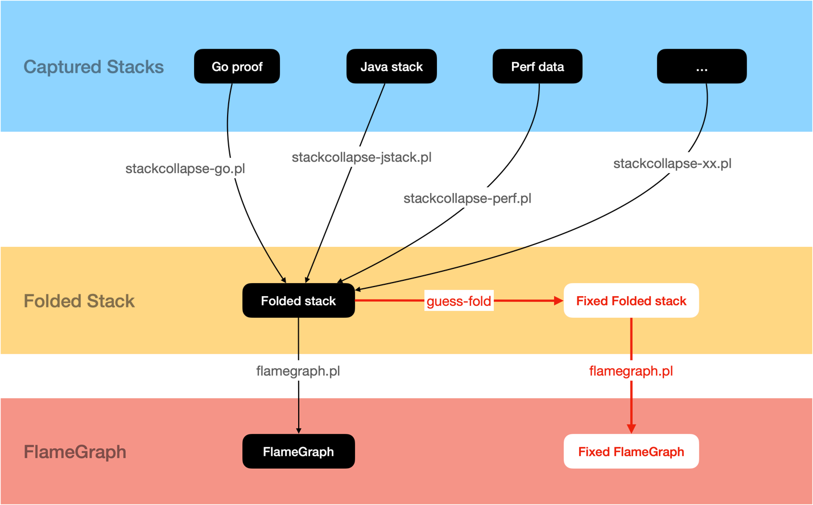

# guess-fold

The folded stack format is the intermediate format used to generate flame graph (defined by the [FlameGraph] repo).
The [FlameGraph] provided a series of tools to extract a variety of profile files to the folded stacks, so that we can
generate flame graphs for all the profile types.

[FlameGraph]: https://github.com/brendangregg/FlameGraph

The `guess-fold` takes the folded stack file as input and generate another folded stack file with the missing root stack nodes fixed (by guessing), enabling the stacks to align with each other. So it will be able to fix flame graphs for all the profile types supported by [FlameGraph]. 



# Usage

```
usage: guess-fold [<flags>]

A tool to fix the missing root call nodes of deep stacks in folded stacks, so that the stacks can align with each other. The output is also folded stacks.

Flags:
      --help         Show context-sensitive help (also try --help-long and --help-man).
  -i, --input="-"    input folded stack file. "-" means read from the standard input stream
  -o, --output="-"   output folded stack file, "-" means write to the standard output stream
  -O, --overlap=5    the minimal overlapping call node count
  -b, --base=0       number of the base nodes who always exist for all stacks, no matter whether the root call nodes are trimmed. (such as the process name for multi-process pprof)
  -d, --depth=0      the minimal depth of the stack who may be trimmed (the deep stacks still remains deep after trimmed, base nodes not counted)
  -v, --verbose ...  show verbose info on fixing the pprof
      --version      Show application version.

```

# Example

```
go tool pprof -raw profile.pprof |\
  stackcollapse-go.pl |\
  guess-fold |\ # fix the folded stacks
  flamegraph.pl
```

# Installation

```
go get github.com/xnslong/guess-stack/guess-fold
```