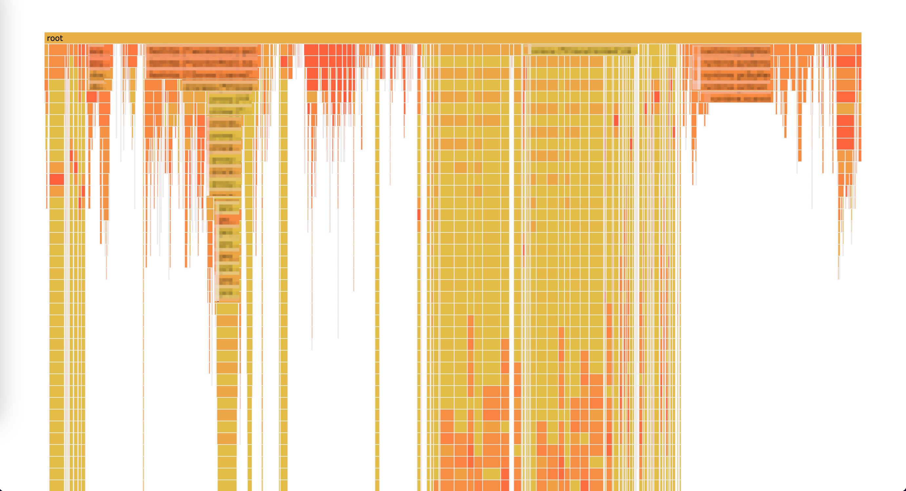

# README

当使用 [pprof](https://github.com/google/pprof) 对一个运行的进程采样的时候，栈可能会因为太深而被截掉部分根部的栈节点。
从而导致火焰图中，栈没有办法对齐，很难分析。

当前工具就是通过猜测和补全这些被截断丢失的栈节点的方式，修复火焰图，使栈能重新对齐，便于pprof的分析。

```bash
guess-pprof -i before.pprof -o after.pprof
```

修复前：before.pprof



修复后：after.pprof


## 怎样补全栈节点？

设想有一个图中有两个栈：A 和 B，假设 A 栈的根部节点能够覆盖 B 栈的一部分节点，
那么我们就猜测，B 栈中重叠部分之下的根部栈节点，可能是 A 栈中被截断的部分栈节点，
于是可以将这些栈节点补全到 A 栈中。（如下图所示）

这里重叠的栈节点部分越长，这个猜测就越准确。


如果你对实现算法感兴趣，可以参考[算法](../fix/README-zh.md).

# 安装

```bash
go get github.com/xnslong/guess-stack/guess-pprof
```

# 使用

```
usage: guess-pprof [<flags>]

A tool to fix the missing root call nodes of deep stacks in pprof result, so that the stacks can align with each other

Flags:
      --help         Show context-sensitive help (also try --help-long and --help-man).
  -i, --input="-"    input pprof file. "-" means read from the standard input stream
  -o, --output="-"   output pprof file, "-" means write to the standard output stream
  -O, --overlap=5    the minimal overlapping call node count
  -b, --base=0       number of the base nodes who always exist for all stacks, no matter whether the root call nodes
                     are trimmed. (such as the process name for multi-process pprof)
  -d, --depth=0      the minimal depth of the stack who may be trimmed (the deep stacks still remains deep after
                     trimmed, base nodes not counted)
  -v, --verbose ...  show verbose info on fixing the pprof
      --version      Show application version.
```

```bash
guess-pprof -i before.pprof -o after.pprof
```
